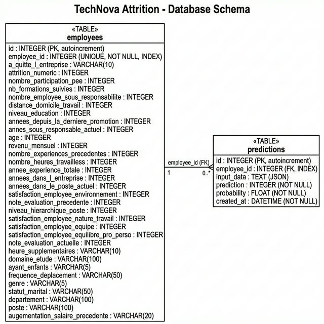

# TechNova Attrition Analysis

## Overview
Project to identify employee attrition causes at TechNova Partners using HR data and surveys.
This project focuses on structuring a machine learning project and preparing it for deployment in a production-like environment.

## Structure
- `data/`: CSV data files.
- `notebooks/`: 
  - `notebook_1.ipynb`: Data cleaning & merging.
  - `notebook_2.ipynb`: Model training & evaluation.
- `src/`: Core logic (`processing.py`, `modeling.py`, `visualization.py`, `api_schemas.py`).
- `api/`: FastAPI server for model serving.
- `db/`: Database layer (SQLAlchemy ORM models, scripts).
- `tests/`: Unit and functional tests.
- `models/`: Trained ML model (joblib).
- `docs/`: Documentation and diagrams.

## Setup

### 1. Installation
```bash
poetry install
```

### 2. PostgreSQL Database Setup

**Prerequisites**: PostgreSQL must be installed and running locally.

```bash
# Install PostgreSQL (macOS)
brew install postgresql@16
brew services start postgresql@16

# Add to PATH (add to ~/.zshrc for permanence)
export PATH="/opt/homebrew/opt/postgresql@16/bin:$PATH"

# Create the database
createdb technova_attrition

# Create tables
poetry run python -m db.create_db

# Seed the dataset (1470 employees from CSV)
poetry run python -m db.seed_db
```

### 3. Running the API
```bash
poetry run uvicorn api.main:app --reload
```
The API will be available at:
- **Root**: http://127.0.0.1:8000
- **Swagger Docs**: http://127.0.0.1:8000/docs
- **ReDoc**: http://127.0.0.1:8000/redoc

### 4. Running Tests
```bash
poetry run pytest tests/ -v
```

### 5. Running Notebooks
```bash
poetry run jupyter notebook
```

---

## API Endpoints

| Method | Endpoint | Description |
|--------|----------|-------------|
| `GET` | `/` | Health check — verifies model and database status |
| `GET` | `/predict/{employee_id}` | Predict attrition for an employee by ID (reads from DB) |
| `POST` | `/predict` | Predict attrition from raw JSON input data |
| `GET` | `/predictions` | Retrieve prediction history (traceability log) |

### Example Usage
```bash
# Health check
curl http://127.0.0.1:8000/

# Predict for employee #1
curl http://127.0.0.1:8000/predict/1

# View prediction history
curl http://127.0.0.1:8000/predictions
```

---

## Database Architecture

### Technology
- **PostgreSQL 16** — relational database for structured data storage.
- **SQLAlchemy** — Python ORM for database interactions (no raw SQL needed).

### Schema (2 tables)



**`employees`** — Stores the full employee dataset (1470 records from `combined_df.csv`).
- `employee_id` (unique, indexed) — employee identifier.
- 27 feature columns (numerical + categorical) matching the ML model's input.
- `a_quitte_l_entreprise` / `attrition_numeric` — target variable.

**`predictions`** — Logs every ML prediction for full traceability.
- `employee_id` (FK → employees) — links to the employee.
- `input_data` (JSON) — full input features sent to the model.
- `prediction` — model output (0 = stays, 1 = leaves).
- `probability` — attrition probability score.
- `created_at` — timestamp of the prediction.

### Data Flow
All interactions with the ML model pass through the database:
1. `GET /predict/{id}` → reads employee from PostgreSQL → runs prediction → logs result to `predictions` table.
2. `POST /predict` → validates input via Pydantic → runs prediction → logs result to `predictions` table.
3. `GET /predictions` → queries the prediction history for audit/traceability.

### Database Files
| File | Purpose |
|------|---------|
| `db/database.py` | SQLAlchemy engine and session configuration |
| `db/models.py` | ORM models (`Employee`, `Prediction`) |
| `db/create_db.py` | Script to create all tables |
| `db/seed_db.py` | Script to import CSV data into PostgreSQL |

---

## Documentation

Comprehensive documentation is available in the `docs/` folder:
- [**Technical & Model Report**](docs/TECHNICAL_REPORT.md): Model performance, features, and key predictors.
- [**API User Guide**](docs/API_DOCUMENTATION.md): Detailed endpoint descriptions and usage examples.
- [**Database Schema**](docs/database_schema.png): UML representation of the database.

---

## Maintenance & Retraining
The model should be retrained periodically to avoid performance decay.
1. Update `data/combined_df.csv` with new validated records.
2. Re-run `notebooks/notebook_2.ipynb` to generate a new `.joblib` model.
3. Deploy the new model file to `models/model_pipeline.joblib`.
See the [Technical Report](docs/TECHNICAL_REPORT.md) for full details.

---

## Version Control
This repository uses Git for version control.
Development follows a feature-based branching strategy to ensure clean history and traceability.
- `main` — production branch (triggers deployment).
- `develop` — development/integration branch.
- `feat/*` — feature branches.
- Tags used for release versioning (e.g. `v1.0.0`).

## Key Results
The Random Forest Classifier (72% recall) identified Total Working Years, Monthly Income, and Overtime as primary attrition drivers.

---

## Code and ML Experimentation Standards

### 1. Code Standards (Python)
- **Formatting**: Code must follow PEP 8 conventions. Use `ruff` for linting.
- **Documentation**: Each function must have a docstring detailing inputs/outputs.
- **Typing**: Use type hints for clarity.

### 2. Testing Standards
- **Coverage**: Critical functions in `src/` and API endpoints tested via `pytest`.
- **Local Execution**: Tests must pass before any push.

### 3. ML Experimentation
- **Reproducibility**: Strict use of `random_state` in all models.
- **Data Management**: Raw data excluded from Git via `.gitignore`.

### 4. CI/CD Pipeline
- **CI**: GitHub Actions runs linting (`ruff`) and tests (`pytest`) on every push to `main`/`develop` and on PRs.
- **CD**: Automatic deployment to Hugging Face Spaces from the `main` branch.
- **Secrets**: `HF_TOKEN` secret configured on GitHub for secure deployment.
- **Environments**: `develop` for development, `main` for production.
